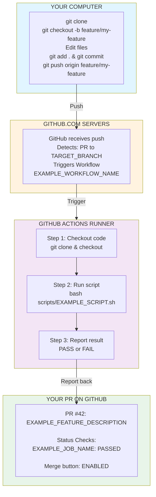
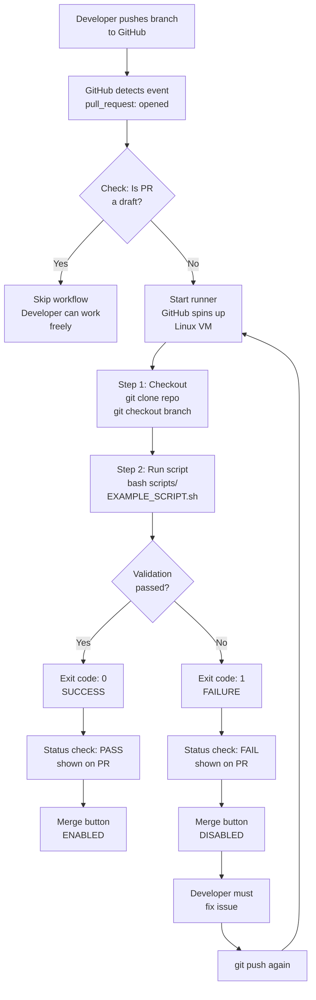
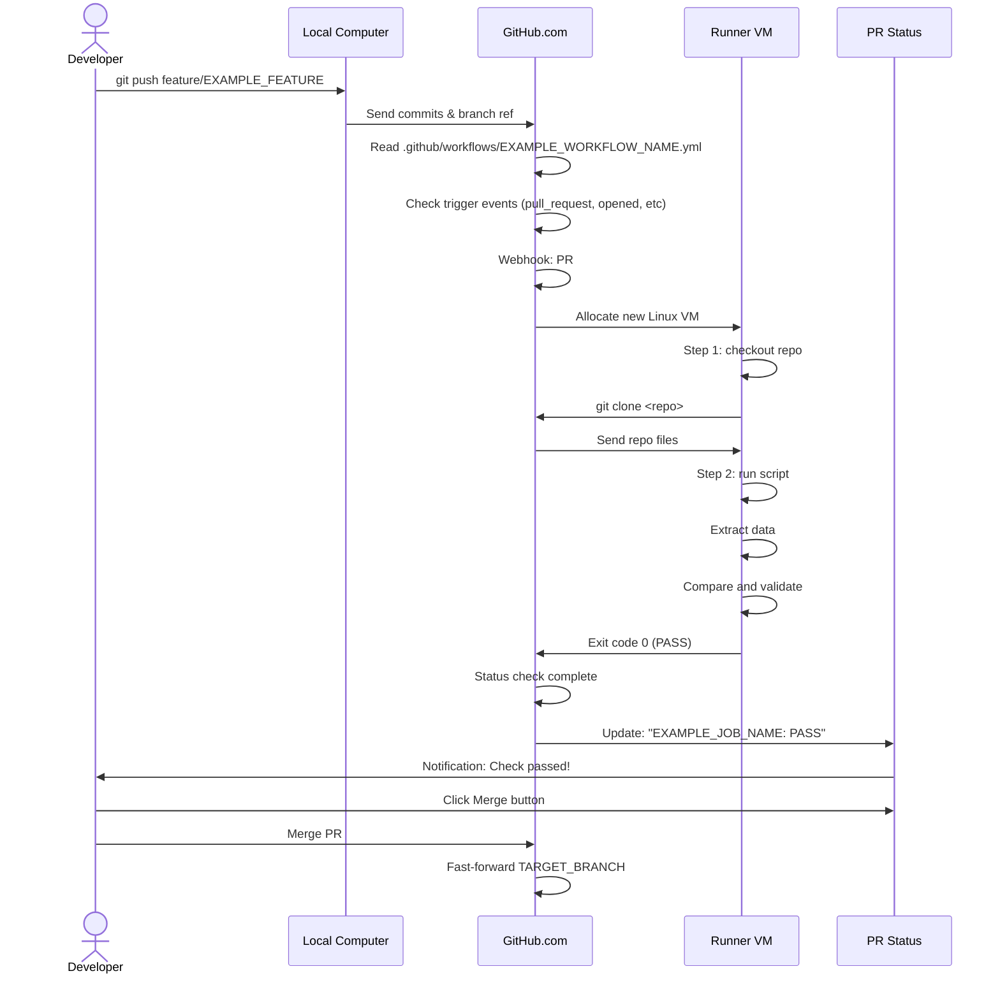
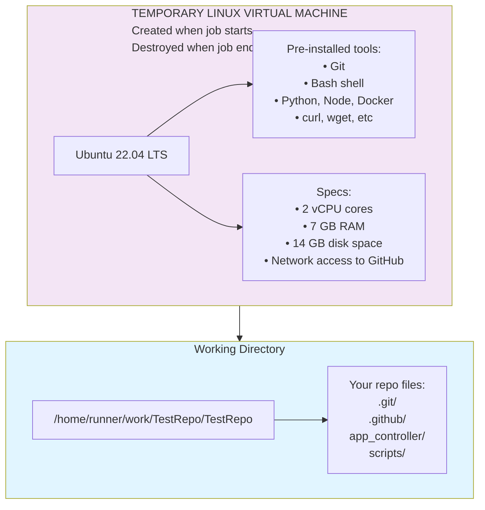
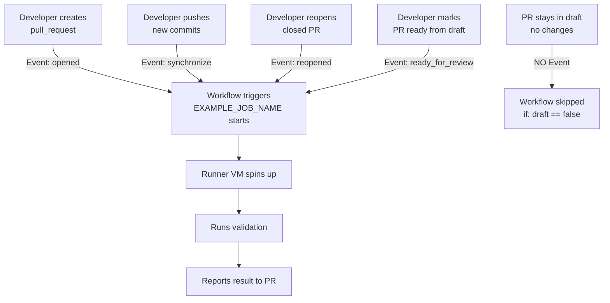
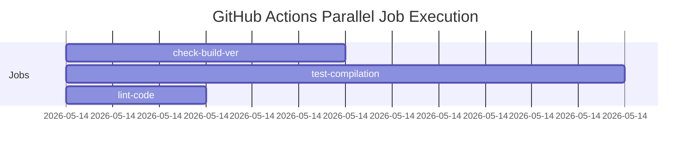
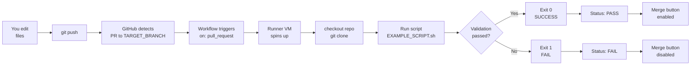

# GitHub Actions: Complete Guide for Embedded Developers

GitHub Actions is GitHub's built-in automation system. It runs scripts automatically in response to events (like PR creation) on GitHub's servers.

> **Note**: This guide uses example scenarios. Replace `EXAMPLE_WORKFLOW_NAME`, `EXAMPLE_JOB_NAME`, and other placeholders with your actual workflow/job names.

---

## Quick Analogy

**Without GitHub Actions:**
```
You: Make code changes
Developer 1: Manually tests on Windows
Developer 2: Manually tests on Linux
Developer 3: Manually checks code style
= Slow, error-prone, human-dependent
```

**With GitHub Actions:**
```
You: Make code changes and push
GitHub: Automatically runs all tests in parallel
= Fast, consistent, no human effort
```

---

## Architecture: Where Things Run



---

## The Workflow File

Your workflow file: `.github/workflows/EXAMPLE_WORKFLOW_NAME.yml`

```yaml
name: EXAMPLE_WORKFLOW_NAME                      # Human-readable name

on:
  pull_request:
    branches:
      - TARGET_BRANCH                           # Only run on PRs to this branch
    types:
      - opened                                  # Trigger on these events:
      - reopened
      - synchronize                             # (new commits pushed)
      - ready_for_review                        # (marked ready from draft)

jobs:
  EXAMPLE_JOB_NAME:                             # Job name
    if: github.event.pull_request.draft == false  # Skip draft PRs
    runs-on: ubuntu-latest                      # Run on Linux server

    steps:
      - name: Check out repository              # Step 1: Get code
        uses: actions/checkout@v4
        with:
          fetch-depth: 0                        # Get full history

      - name: Run validation                    # Step 2: Run script
        env:
          BASE_SHA: ${{ github.event.pull_request.base.sha }}
        run: bash scripts/EXAMPLE_SCRIPT.sh "$BASE_SHA"
```

---

## Workflow Execution Flow



---

## Where Code Actually Runs

### Your Computer (Local)
```bash
# You run these commands:
$ git checkout -b feature/EXAMPLE_FEATURE_NAME
$ vim PATH_TO_CONFIG_FILE  # Example: Edit your config file
$ git add .
$ git commit -m "EXAMPLE_COMMIT_MESSAGE"
$ git push origin feature/EXAMPLE_FEATURE_NAME
↑ Everything runs on YOUR machine
```

### GitHub's Servers
```
Your push arrives → GitHub detects it
↓
Searches: .github/workflows/*.yml files
↓
Finds: EXAMPLE_WORKFLOW_NAME.yml
↓
"A PR to TARGET_BRANCH was created → trigger this workflow"
```

### GitHub Actions Runner (Temporary Linux VM)
```bash
# GitHub spins up a Linux machine (ubuntu-latest)
# Runs these steps automatically:

Step 1: actions/checkout@v4
  $ git clone https://github.com/your-org/your-repo.git
  $ cd your-repo
  $ git checkout your-branch

Step 2: Custom script
  $ bash scripts/EXAMPLE_SCRIPT.sh <base-sha>
  
  Inside script:
    - Extract data from your branch
    - Compare with TARGET_BRANCH
    - Validate against requirements
    - Output result
    - Exit with code 0 (pass) or 1 (fail)

Step 3: Report back to GitHub
  GitHub records: "Job passed" or "Job failed"
  Updates PR status checks
```

After job finishes, runner is destroyed. No resources used if job not running.

---

## Complete Data Flow



---

## Runner Anatomy

A GitHub Actions "runner" is essentially:



When a job runs:

```bash
# Job starts
runner$ pwd
/home/runner/work/TestRepo/TestRepo

# Code is checked out
runner$ ls -la
.git/
.github/
app_controller/
scripts/
...

# Your script runs
runner$ bash scripts/check_build_ver_bump.sh abc123
[checking version bump...]
[PASS] At least one version was incremented

# Job ends
# Runner is terminated
```

---

## Environment Variables & Secrets

The workflow can access GitHub context:

```yaml
steps:
  - name: Access PR information
    run: |
      echo "PR #: ${{ github.event.pull_request.number }}"
      echo "Base branch: ${{ github.event.pull_request.base.ref }}"
      echo "Head branch: ${{ github.event.pull_request.head.ref }}"
      echo "Base SHA: ${{ github.event.pull_request.base.sha }}"
      echo "Author: ${{ github.event.pull_request.user.login }}"
```

In your workflow:

```yaml
env:
  BASE_SHA: ${{ github.event.pull_request.base.sha }}

steps:
  - name: Run check
    run: bash scripts/check_build_ver_bump.sh "$BASE_SHA"
    # BASE_SHA is passed to the script
```

---

## What Happens at Each Event



---

## Multiple Runners (Parallelization)

If you had multiple jobs, they could run in parallel:

```yaml
jobs:
  check-build-ver:
    runs-on: ubuntu-latest
    steps:
      - run: bash scripts/check_build_ver_bump.sh

  test-compilation:
    runs-on: ubuntu-latest
    steps:
      - run: make build

  lint-code:
    runs-on: ubuntu-latest
    steps:
      - run: pylint src/
```

This would spin up THREE runners simultaneously:



All run at same time, results collected.

---

## Viewing Workflow Execution

On GitHub PR page:

```
PR #42: Add temperature calibration

Checks (1 completed)
├─ Enforce build_ver bump
   └─ check-build-ver
      Status: PASSED
      Duration: 2m 3s
      
      Logs:
      ├─ Check out repository (5s)
      ├─ Require build_ver change (10s)
      └─ [PASS] At least one version was incremented
```

You can click to see full logs from runner.

---

## Cost Implications

**For public repos:** GitHub Actions is FREE
- Unlimited minutes per month
- No credit card required

**For private repos:** 
- 2,000 free minutes/month (included with account)
- Each additional 1,000 minutes = $0.24

**Your usage:** 
- Each run takes ~30 seconds
- ~1.5 minutes per day if 3 PRs
- Well within free tier

---

## Troubleshooting Workflows

### Problem: Workflow not triggering

**Cause**: Workflow file has syntax error

**Check**:
```bash
# Verify file exists and format is valid
cat .github/workflows/EXAMPLE_WORKFLOW_NAME.yml

# Check in GitHub UI: Settings → Actions → Workflows
# If syntax error, it won't appear
```

### Problem: Script fails but shouldn't

**Check logs**:
1. Go to PR page
2. Click "Details" on failed check
3. See full runner output
4. Look for error messages

### Problem: Can't see status check on PR

**Cause**: Workflow hasn't run yet

**Fix**:
1. Verify workflow file exists: `.github/workflows/EXAMPLE_WORKFLOW_NAME.yml`
2. Create NEW PR to `TARGET_BRANCH`
3. Workflow triggers automatically
4. After first run, appears in branch protection options

---

## Workflow Execution Simplified



---

## Key Takeaways for Embedded Developers

1. **GitHub Actions = Automation in the cloud**
   - You push code
   - GitHub runs scripts automatically
   - Reports results back on PR

2. **Runs on temporary Linux VMs**
   - Spun up on-demand
   - Destroyed after job ends
   - Isolated environment

3. **No manual work needed**
   - Script runs same way every time
   - Consistent results
   - Catches issues before merge

4. **Workflows live in `.github/workflows/`**
   - YAML format (easy to read)
   - Triggered by events (PR, push, schedule, etc)
   - Can run shell scripts, docker, etc

5. **Integrated with branch protection**
   - Failing check blocks merge
   - Prevents non-compliant code from reaching `TARGET_BRANCH`
   - Enforces quality standards

---

## How to Adapt This Guide

- Replace `EXAMPLE_WORKFLOW_NAME` with your actual workflow name
- Replace `EXAMPLE_JOB_NAME` with your job name
- Replace `EXAMPLE_SCRIPT.sh` with your script name
- Replace `TARGET_BRANCH` with your integration branch (develop, main, etc)
- Replace other EXAMPLE_* placeholders with your specific content
