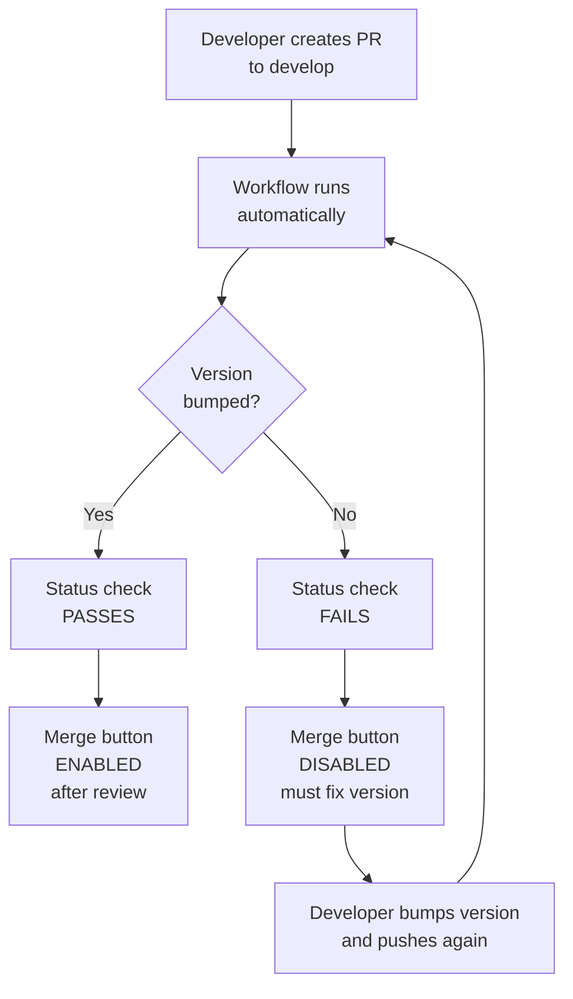

# GitHub Website Setup: Step-by-Step Configuration

This guide walks you through the GitHub website UI to activate the version enforcement system for your repository.

## Prerequisites
- Push the workflow file: `.github/workflows/enforce-build-ver-bump.yml`
- Push the script: `scripts/check_build_ver_bump.sh`
- Push the PR template: `.github/pull_request_template.md`

All should be in your `develop` branch.

---

## Step 1: Verify Workflow is Active

### 1.1: Navigate to Actions
```
GitHub Repo → Actions (tab at top)
```

### 1.2: Check Workflow Status
```
You should see:
├─ Workflows
│  └─ "EXAMPLE_WORKFLOW_NAME"
│     Status: Active (green checkmark)
```

**If NOT showing:**
1. Go to: `Settings` → `Actions` → `General`
2. Under "Actions permissions", select: **"Allow all actions and reusable workflows"**
3. Click: **Save**
4. Wait 1-2 minutes for workflow to appear

### 1.3: Manual Test (Optional)
1. Create a test branch: `git checkout -b test/verify-workflow`
2. Make a dummy change: `echo "test" >> test.txt`
3. Push: `git push origin test/verify-workflow`
4. Create PR to `develop` (NOT draft)
5. Go to PR page → **Checks** section
6. You should see your workflow running

---

## Step 2: Enable Branch Protection Rules

### 2.1: Navigate to Branch Protection Settings
```
GitHub Repo → Settings (gear icon at top right)
           → Branches (left sidebar)
           → Add rule (button)
```

### 2.2: Create Protection Rule for `develop` Branch

**Branch name pattern:**
```
develop
```

Click **Create** (or skip to next step if rule already exists for develop)

### 2.3: Configure Protection Settings

#### [REQUIRED] Require a pull request before merging

- [✓] **Require pull request reviews before merging**
  - Number of required reviews: `1`
  - [✓] Dismiss stale pull request approvals when new commits are pushed (optional)
  - [ ] Require review from code owners (only if using CODEOWNERS file)

#### [REQUIRED] Require status checks to pass before merging

1. [✓] **Require branches to be up to date before merging**

2. [✓] **Require status checks to pass before merging**
   - Click in search box: "Status checks that are required to pass"
   - Search for: `EXAMPLE_JOB_NAME` (your job name)
   - You might NOT see it yet (explained below)

#### [OPTIONAL] Other Security Settings

- [✓] **Require commits to be signed** (recommended)
- [✓] **Include administrators** (recommended)
- [✓] **Restrict who can push to matching branches** (if needed)

### 2.4: If Status Check Not Appearing

**Why:** GitHub needs workflow to run at least once before it appears in the list

**Solution:**
1. **Save the branch protection rule WITHOUT the status check first**
   - Just enable: "Require PR reviews"
   - Click **Save changes**

2. **Trigger the workflow:**
   - Create test PR to `develop` (not draft)
   - Wait ~1 minute for workflow to run

3. **Go back to branch protection settings:**
   - Repo → Settings → Branches → develop rule
   - Now search for `EXAMPLE_JOB_NAME`
   - It should appear in the dropdown
   - [✓] Select it

4. **Save changes**

---

## Step 3: Verify Branch Protection is Working

### 3.1: Create a Test PR Without Version Bump

```bash
git checkout -b test/no-bump develop
echo "test change" >> sample.txt
git add .
git commit -m "Test: no version bump"
git push origin test/no-bump
```

Then on GitHub:
1. Click **Create Pull Request**
2. Set target: `develop`
3. Fill in PR template (just dummy content)
4. Click **Create Pull Request** (NOT draft)

### 3.2: Check Status

You should see:
```
Status checks
├─ EXAMPLE_JOB_NAME: PENDING → Running...
│  (After ~30 sec)
├─ EXAMPLE_JOB_NAME: FAILED [✗]
├─ Required reviewers: 0 of 1 (needs 1 review)

Merge button: DISABLED (greyed out)
Message: "Some checks were not successful"
```

### 3.3: Verify You Cannot Merge

Try clicking **Merge pull request** button:
```
❌ Cannot merge
"This branch has 1 failed status check and 0 approving reviews."
```

### 3.4: Fix Version & Retry

```bash
git checkout test/no-bump
# Edit EXAMPLE_VERSION_FILE and bump version
git add .
git commit -m "Bump version"
git push origin test/no-bump
```

Back on GitHub PR:
1. Workflow re-runs automatically
2. Check becomes PASSED [✓]
3. Merge button might still be disabled (waiting for review)
4. Request a teammate to approve
5. Once approved + check passes → Merge becomes enabled

---

## Step 4: Configure PR Template Display (Optional)

The PR template should display automatically, but verify:

### 4.1: Check Template File Location
```
Path must be exactly:
.github/pull_request_template.md

NOT:
.github/pull_request_template.txt
.github/templates/pr-template.md
pull_request_template.md (root level)
```

### 4.2: Test Template Display

1. Go to your repo main page
2. Click **Contribute** → **New pull request**
3. Click **create a new branch** (if needed)
4. You should see PR template pre-filled in description box

If not showing:
- Verify file path is correct
- Commit is pushed to `develop`
- Refresh browser (hard refresh: Ctrl+Shift+R)

---

## Step 5: Final Verification Checklist

- [ ] Workflow file exists: `.github/workflows/EXAMPLE_WORKFLOW_NAME.yml`
- [ ] Workflow appears in: Actions → Workflows tab
- [ ] Workflow is Active (green checkmark)
- [ ] Branch protection rule created for `develop`
- [ ] Status check `EXAMPLE_JOB_NAME` is required
- [ ] PR reviews required: 1 person minimum
- [ ] PR template visible when creating PRs
- [ ] Test PR without version bump → merge blocked
- [ ] Test PR with version bump → merge allowed (after review)

---

## Troubleshooting

### Problem: "Status check not appearing in dropdown"

**Solution:**
1. Save branch protection WITHOUT status check
2. Create test PR and let workflow run completely
3. Go back to Settings → Branches → develop
4. Status check should now appear in dropdown
5. Select it and save

### Problem: "Merge button still disabled after workflow passes"

**Cause:** Waiting for code review approval

**Solution:**
1. Go to PR page
2. Click **Request reviewers** (top right)
3. Select a teammate
4. They approve on PR
5. Once approved + workflow passes → merge enabled

### Problem: "Workflow runs but always fails"

**Cause:** Script has an issue or version format wrong

**Solution:**
1. Click workflow run on PR page
2. Click **Details** on failed check
3. Scroll down to see error messages
4. Fix the issue in your script or version format
5. Push again

### Problem: "Settings not saving"

**Cause:** Might be permissions issue

**Solution:**
1. Verify you're repository admin
2. Clear browser cache
3. Try different browser
4. Contact repository owner

---

## Summary of What Gets Activated

Once all these steps are complete:



---

## What Now?

1. **Follow steps 1-5 above**
2. **Test with a dummy PR** (as shown in Step 3)
3. **Communicate to your team** the new process:
   - All PRs to `develop` need version bump
   - PR template explains how
   - Workflow validates automatically
   - Merge blocked if check fails

---

## Common Questions

**Q: Do I need to do this every time I make a PR?**
```
No, these are one-time setup steps on GitHub website.
After this, everything is automatic.
```

**Q: What if someone tries to bypass the protection?**
```
They can't. Branch protection rules can't be overridden 
(unless they're a repository admin and temporarily disable it).
```

**Q: Can I test these changes on a different branch first?**
```
Yes. Create protection rule for any branch to test.
Once working, apply same settings to develop.
```

**Q: What if the workflow file has a syntax error?**
```
It won't appear in the Actions tab.
Check: Settings → Actions → check for error messages
Fix the YAML syntax and push again.
```
